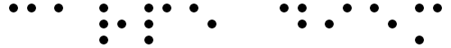

# Image-Processing-SCC0251---Final-project
Final graduation project of the SCC0251 - Image Processing discipline.

## Students

  [Caio Basso](https://github.com/caioadb)

  [Gabriel Garcia Lorencetti](https://github.com/gabriellorencetti)

  [Leonardo Rossi Luiz](https://github.com/leonrossi)

  [Witor Matheus Alves de Oliveira](https://github.com/witorMao)

  We all participate equally in the development of the project by doing most of the times pair coding.

## Main objective
The main objective of this project is to build a program able to recognize letters of a braille text present in an image digitally generated, i.e, given an input image, containing a text in braille, perform the translation to the alphabetic writing system.

## Description of input images
The images we will use will be images generated with our own program. For that we use the images related to the braille characters used in the dictionary.

  ### 
  Figure 1 - “hello world” braille text example.

  ### 
  Figure 2 - “image processing” braille text example.
  
  ### 
  Figure 3 - “carpe diem” braille text example.

## Steps to reach the objective
First of all, we generate the images by giving a text to a program build previously, were each character of the text was converted to its respective braille character and then "append" these images to create the image that correspond to the intial text.

We will apply enhancements to the images to highlight the color changes between the symbols and the background in order to obtain an image only with two colors. For this we use the [*luminance*](https://en.wikipedia.org/wiki/Luminance) technique for convert the input RGB image to a grayscale image. After this, we use the [*quantisation*](https://en.wikipedia.org/wiki/Quantization_(signal_processing)) technique with the argument 1 just to convert the values of intensity to a binary range and get a black/white image. The final step of the preprocessing part was use the [*closing*](https://en.wikipedia.org/wiki/Closing_(morphology)#:~:text=In%20image%20processing%2C%20closing%20is,while%20closing%20removes%20small%20holes.) technique to create a standard between the dots present in the images in order to make the future comparison part easier.

Second, we apply an image segmentation, so we can separate the braille character in the given image and then pass those symbols to a final step in the program. For each character we divide it in six regions and then compare these regions with two images (the *right dot* and the *left dot* images) to identify if in the regions exist a dot or not and from that create a array of size six where each position represet one region of the character and receive 0 if that area do not have a dot or 1 if have it.

Finally, we create a dictionary with the braille characters previously generated. After that we get the characters represented in the array form quoted above, then search for the character in the dictionary, if the character was found we append it to the final string that contains the translated text in the alfabetic form.

## First results
  
  Down bellow we show some images before and after we conclude the image enhancement stage.

  ### 
  Figure 4 - The image above is the original *Hello World* image and the other is the image after the enhancement applied.
  
  ### 
  Figure 5 - The image above is the original *Colorized* image and the other is the image after the enhancement applied.
  
  ### 
  Figure 6 - The image above is the original *My Precious* image and the other is the image after the enhancement applied.

## Final Results

Here we show some results obtained with the program:

  **Failure case**:

  ### 
  Figure 7 - image generated by a external font previously planned to be used.

  We note that the distance between the characters change significantly and this occour for every external font that we tried so we choose to standardize the image genearation.

  **Succes case**:

  ### 
  Figure 8 - Image generated by the text "vem vacina". 
  
  Bellow in the Figure 9 we have the result of the image above processed by the program.

  ### 
  Figure 9 - The result generated by the program for the Figure 8 as input.

